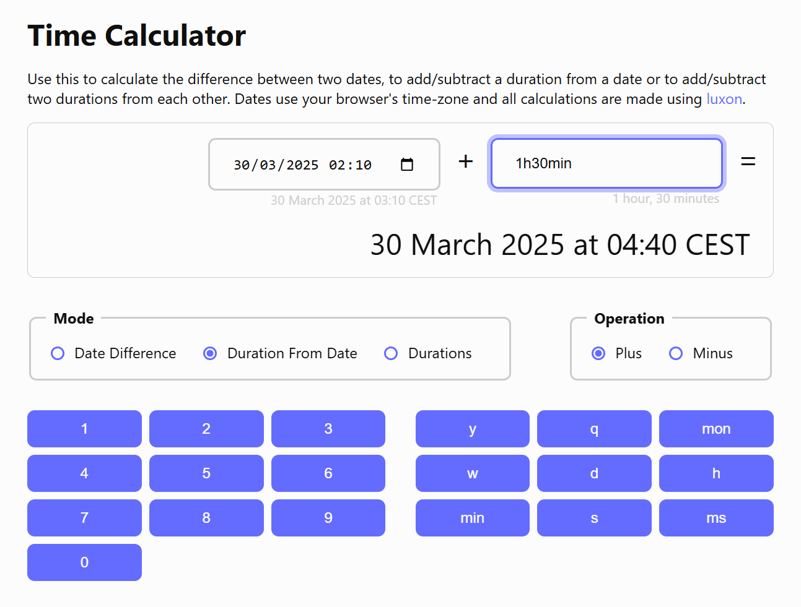

# Time Calculator

> This is a demo for using [Luxon](https://moment.github.io/luxon) and vanilla CSS with variables

Visit the demo at https://westwood846.github.io/time-calculator. Use this to calculate the difference between two dates, to add/subtract a duration from a date or to add/subtract two durations from each other. Time-zones, daylight-savings time, leap-seconds etc. are handled by the underlying Luxon date-time library.

